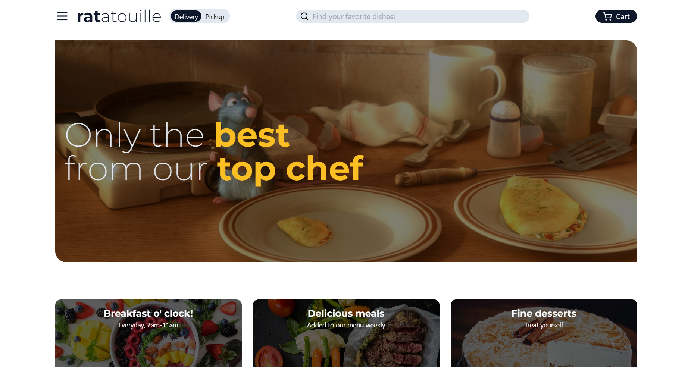

# Ratatouille
Welcome to Ratatouille, the ultimate online destination for savoring culinary excellence by the renowned chef Remy. Indulge in a symphony of flavors as you explore a curated menu of exquisite dishes, each crafted with passion and expertise. Elevate your dining experience as Ratatouille seamlessly connects you with Remy's signature creations, right at your fingertips. From classic favorites to innovative delights, embark on a gastronomic journey that embodies artistry and taste. Order with ease, and let Ratatouille bring the essence of gourmet cuisine from Remy's kitchen to your table. Bon appétit! 

## 🏅 Acknowledgments
Based on [Code Commerce's tutorial](https://www.youtube.com/watch?v=GDd2c70gsxE). Thank you!

🔗 [See it live!]()

## ⚙️ Tech

 
 
 
 
 
## Available Scripts

In the project directory, you can run:

#### `npm start`

Runs the app in the development mode.\
Open [http://localhost:3000](http://localhost:3000) to view it in your browser.

The page will reload when you make changes.\
You may also see any lint errors in the console.

#### `npm run build`

Builds the app for production to the `build` folder.\
It correctly bundles React in production mode and optimizes the build for the best performance.

The build is minified and the filenames include the hashes.
